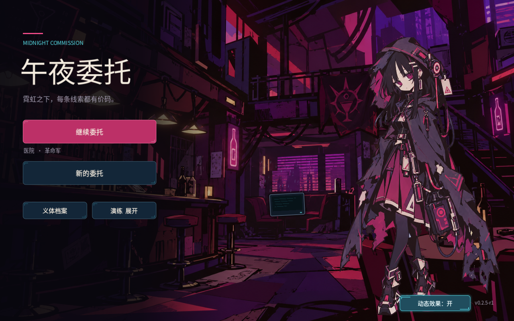

# 主菜单制作 TODO

## 审核 GIF 与右侧菜单接入（2026-10-07）

按用户新确认，使用 `assets/menu/noren-bar-idle-motion-v2-neon.gif` 作为背景，
标题与入口移到右侧；用户随后指定 1.5 倍速，实际循环为 3.2 秒。
源帧保持 60 帧与每帧 80ms。本轮另行验收，不沿用 P0 结果。

- [x] G00：核对审核 GIF、当前菜单和维护边界，保留修改前文件与存档快照。
- [x] G01：无损提取 60 帧，60/60 RGB 像素一致，核对 80ms 时长和来源哈希。
- [x] G02：接入序列播放、静态模式、失焦暂停和退出清理。
- [x] G03：完成右侧轻量菜单、标题及局部文字遮罩。
- [x] G04：用户自行完成游戏内验证并确认通过；自动两尺寸各 89 项通过。
  宽屏失焦和性能采样中断的记录保留，不声明自动性能验收通过。
- [x] G05：更新来源、维护说明与本轮验收证据。

## 首版 P0 历史记录

依据[主菜单重构规划](主菜单重构规划.md)，于 2026-10-07 开始执行。
用户已授权完成首版 P0：酒馆窗边与委托终端、五个既有入口、窗外雨、
局部霓虹、终端提示灯和静态模式。本表只按实际完成与验证结果核销。

- [x] M00：核对规划、菜单流程、素材和工程约定。
- [x] M01：保存修改前文件、实际菜单截图及正式存档哈希。
- [x] M02：检查原酒馆与诺伦静止站姿构图，保留菜单空间与角色辨识。
- [x] M03：接入主次菜单、标题与只读进度摘要。
- [x] M04：完成继续、新游戏确认、义体档案和两种演练的实际输入。
- [x] M05：使用用户原图副本，接入窗口、霓虹、终端局部遮罩，保存来源与 SHA256。
- [x] M06：接入窗外雨、局部霓虹、终端提示灯，检查循环与遮挡。
- [x] M07：完成静态开关、失焦暂停、退出清理与安全返回。
- [x] M08：完成三尺寸输入各 65 项、20 秒动画观察和性能对照。
- [x] M09：核对并如实记录存档差异、完成隔离复核、更新维护与验收说明。

首版已作为 **0.2.5-r1** 交付。追加隔离检查 66 项、地图回归 111 项均零失败；
原始图片与工程副本未变，隔离复核前后 10 项正式存档路径未变。初始快照与最终
正式检查点／备份存在两项测试开始前的更新，来源未确认，不回滚当前进度，详见
[验收记录](主菜单验收记录.md)。

证据根目录为 `artifacts/qa/menu-redesign-2026-10-07/`。首版不包含规划
中的 P1／P2；不自动提交或推送本轮变更，完成后交付工程内文件及截图。
