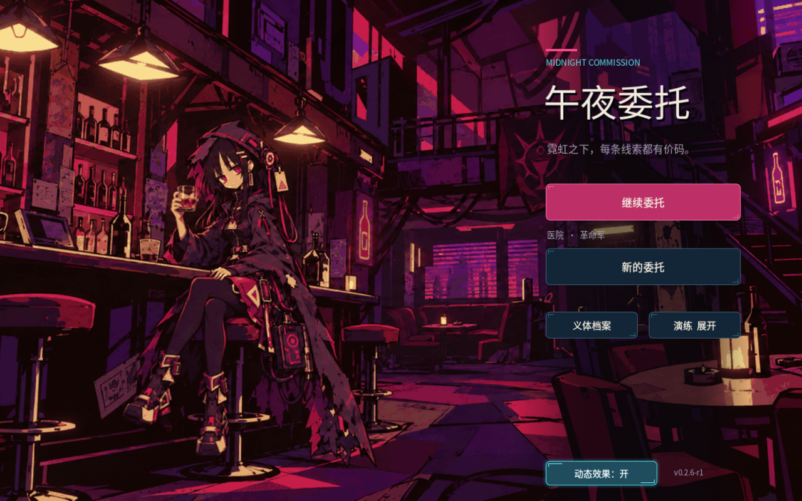

# 主菜单验收记录

## 0.3.21-library 全屏密集牌库（2026-10-10）

牌库占满游戏画布，改为七列、紧凑顶栏和右上角“×”关闭；一屏完整容纳 21 张，当前实际卡池仍为四种。主菜单入口和原有冒险状态不变。

`tests/card_library_visual.tscn` 在 1280×800 与 1600×1000 各 **39 checks、0 failures**。覆盖右上角叉号鼠标关闭、Esc、原有只读和菜单流程、21 张可见容量、32 种内存样本的滚动及末张可达。实际四卡页与多卡样本截图均已目视检查，三个正式存档路径前后未变。32 种卡仅用于本轮容量测试，不写正式目录或玩家牌组。

证据在 `artifacts/qa/card-library-fullscreen-2026-10-10/`。本次验证只覆盖牌库和相关菜单路径，不替代全游戏或背景性能验收。

## 0.3.20-library 主菜单牌库（2026-10-10）

主菜单“新的委托”下增加“牌库”按钮，四列展示当前全部四种测试战斗卡。义体和演练入口下移，展开后仍无重叠；背景和菜单环境组件不改写。

Godot 4.7.2／Compatibility／Apple M5，`tests/card_library_visual.tscn` 在 1280×800 与 1600×1000 各 **35 checks、0 failures**。实际视口输入覆盖空进度入口、Enter 激活、卡面只读、未获得卡牌显示、已拥有重复卡去重、按钮／Esc 返回、确认弹层禁用牌库、展开演练布局、浏览后继续原冒险，以及内存中临时扩展为 16 种卡的滚轮／Home／End。卡面、主菜单和展开演练三种截图在两个尺寸均已目视检查。正式存档、备份及 Meta 文件哈希／存在性未变；新测试使用专用存档路径。

首轮测试脚本缺少动态字典类型标注，解析失败；修正后两尺寸均通过，失败日志保留。本次未重跑完整菜单性能或全游戏测试，历史失败不被这次专项结果覆盖。

证据沿用任务开始日期目录：`artifacts/qa/card-library-2026-10-09/`，最终验收日期为 2026-10-10。
[主菜单](../artifacts/qa/card-library-2026-10-09/1280x800-menu.png) · [牌库](../artifacts/qa/card-library-2026-10-09/1280x800-library.png) · [验证结果](../artifacts/qa/card-library-2026-10-09/result.json)

## 0.3.18-hd 原生全彩背景（2026-10-08）

原因：旧运行时将原生 1672×941 图缩成 1008×567 的 GIF，再放大铺屏；第 0 帧仅
238 种实际 RGB 颜色。原 PNG 有 277,040 种实际颜色，原生像素约为旧帧的 2.75 倍。
纹理导入原本已经是无损、无限制尺寸，`canvas_items` 也已启用，问题在动画源。

本次直接加载未改写的原 PNG，用 `menu_native_art.gdshader` 按旧工具的多边形、
动作角度、灯光参数和灯牌关键帧采样。保留 60 个时序位置、1.5 倍速、3.2 秒循环、
静态开关与失焦暂停、右侧菜单布局。旧 GIF／PNG 帧仍保留作历史资料，不在菜单加载。
没有生成新的角色或背景，也没有将旧小图放大后称为 4K。

- Godot 4.7.2／Compatibility／Apple M5 实际渲染；大窗口截图为 2668×1668
  （请求 2880×1800 后受屏幕高度及逻辑画布比例限制）。修改前后 capture 各 37 项零失败。
- 1600×1000 `native_art` 专项 50 项零失败：真实 GPU 像素采样确认手部、两只靴子
  移动和两块灯牌变暗；键盘开关、静态时钟、返回菜单保持偏好、退出释放纹理通过。
- 原 PNG SHA256：`754ed7c4944d106957e9ad28f65ea493e2ed37606f4319af62c6fd7e41e136d6`。
  三个正式存档文件前后哈希一致；测试运行于 `/private/tmp/midnight-menu-hd-qa`
  隔离工程，autoload 使用独立用户目录，测试存档另写 QA 目录。
- 旧完整鼠标 input 套件未通过：高清版在返回页面后出现三项开关相关断言失败，
  最小化恢复后截图等待卡住，停止了该测试进程；修改前代码诊断也出现一次 Esc
  断言失败。尚未确定所有失败原因，不宣称完整交互回归通过。上述独立高清专项
  已覆盖本次变更的开关和生命周期，不改业务交互以绕过旧套件失败。
- 初次大窗口性能采样仍在计时期间编码截图，导致时钟／帧推进计数不足；将截图
  移到计时区间外、保持原断言阈值后，下一次采样受到失焦暂停影响仍未通过。
  两次失败日志保留，不把渲染帧率等同于持续动画验收。随后前台补测时页面
  被切换至对白，采样中断（`performance-1600-foreground`），也不计为通过。

证据：`artifacts/qa/menu-hd-2026-10-08/`。本轮没有运行完整剧情或战斗回归。

[修改前](预览/主菜单高清/修改前.png) · [原生高清实际截图](预览/主菜单高清/原生高清.png)

## 0.2.6-r1 用户审核动画与右侧菜单

2026-10-07 接入审核的 `noren-bar-idle-motion-v2-neon.gif`，60 帧逐帧 RGB
一致；源 80ms／帧、4.8 秒不变，运行时默认 1.5 倍速、3.2 秒循环。
右侧 350px 菜单与局部渐暗遮罩为标题和入口提供对比。
用户随后自行完成游戏内验证并明确确认全部通过。

自动证据位于 `artifacts/qa/menu-gif-2026-10-07/`：`03-import-isolated`
导入通过；`04-capture` 37 项通过；`08-input-1280-final` 和
`09-input-1600-final` 各 89 项零失败，涵盖静态开关、帧推进、最小化暂停与
获得焦点后恢复、页面退出和纹理释放、既有入口与确认弹层。
宽屏 `10-input-wide-final` 因失焦出现动画推进断言失败；`11-performance`
采样中断，结果标记未通过，没有完整性能数据。保留这些日志，不将用户手动验收
等同于自动性能验收，也不复用旧 P0 的帧率。早期隔离导入与输入失败记录保留。



以下为 0.2.5-r1 P0 的历史验收记录。


本轮于 **2026-10-07（Asia/Shanghai）** 实施并验证，交付版本为
**0.2.5-r1**，基线为本地提交 `ad52fdf` 的 0.2.4-r1。范围为
[规划](主菜单重构规划.md)中的 P0；进度见[制作 TODO](主菜单制作TODO.md)。

## 实际画面与素材

使用用户指定的 `D:/Major Project/GodotGameDemo/asset/source` 原始素材：
`场景/地下酒馆.png`、`角色/诺伦.png`。两者与工程既有 `bar.png`、`noren.png`
副本逐字节相同，SHA256 记录在
[来源清单](../assets/menu/source-manifest.json)。本轮没有将新生成图片接入游戏，
没有修改原图；诺伦沿用原立绘的静止站姿。

左侧 500 逻辑像素组织标题、委托入口、只读摘要与次级功能，640 像素渐暗遮罩
保障文字辨识。窗口细雨、中央瓶形霓虹与桌面终端状态灯独立变化，不移动角色、
按钮或文字。灯光周期分别为 6 秒、3 秒，UI 淡入 0.4 秒。


## 运行与输入证据

证据根目录：`artifacts/qa/menu-redesign-2026-10-07/`。所有子进程在 autoload
执行前隔离 `APPDATA`；保存、备份及局外资料均使用测试专用路径。
可见图形测试顺序运行，通过视口输入事件分发并移动系统鼠标，不直接触发按钮信号。

| 检查 | 本轮结果 | 证据子目录／文件 |
| --- | --- | --- |
| 修改前基线 | 原菜单实际截图、运行时文件与正式存档哈希已留存 | `before/` |
| 1280×800 输入 | 65 checks，0 failures，退出 0、stderr 空 | `08-input-final-1280/` |
| 1600×1000 输入 | 65 checks，0 failures，退出 0、stderr 空 | `09-input-final-1600/` |
| 1440×810 输入 | 65 checks，0 failures，退出 0、stderr 空 | `10-input-final-wide/` |
| 环境与性能 | 19 checks，0 failures，退出 0、stderr 空 | `07-performance/` |
| 资源与脚本导入 | 隔离路径重试通过，无脚本／着色器错误 | `12-import-retry/` |
| 地图输入回归 | 111 checks，0 failures，退出 0、stderr 空 | `13-map-regression/` |
| 追加隔离输入复核 | 66 checks，0 failures，含 autoload 实际用户目录检查 | `14-input-isolation/` |
| 整段制作期间存档核对 | 8／10 未变；检查点与备份在 15:56 更新，早于自动菜单测试开始 | `formal-save-guard-final.json` |
| 隔离复核前后存档 | 10／10 存在性与哈希全部 unchanged | `formal-save-guard-isolation-before.json`、`formal-save-guard-isolation-after.json` |
| 原始图片与工程副本 | 2 组源图与副本哈希全部 unchanged | `source-guard-final.json` |

65 项菜单检查覆盖标题／摘要／按钮边界、无进度、内存进度、仅磁盘检查点、损坏
检查点、真实继续和新委托、确认与取消、弹层焦点闭环与底层拦截、Tab／Enter／Space／Esc、
义体档案返回、B04／B12 演练入口及进度恢复、动态开关、实际窗口最小化与恢复、
离开菜单释放环境及反复进入时仅保留一份环境。

演练结束使用既有 `Game.finish_training("surrender")` 提交结果，以验证返回与
冒险状态恢复；本轮没有把这一过程写成完整战斗游玩。剧情 690 项、战斗模型
191 项属于历史结果，本轮未复测模型，也未修改其规则。

三尺寸均保持 1440×900 逻辑画布。宽屏窗口为 1440×810，实际视口截图为
1296×810，左右遵循既有留边策略；其余两种截图与窗口同尺寸。

## 动画观察与性能

本机 Godot 4.7.2 Standard、Compatibility，CPU 为 Intel i7-14700HX，GPU 为
NVIDIA GeForce RTX 4070 Laptop GPU。窗口 1280×800，屏幕刷新率约 165 Hz。
使用 `process_frame` 之间的实际时钟间隔采样，并排除截图读取停顿；这不是 GPU
专用计时器，不能据此承诺其他设备性能。资源与环境代码与最终版一致，性能截图
采集后仅更新了项目版本显示与测试检查项。

| 模式 | 采样时长 | 帧样本 | 平均帧时间 | 95% 帧时间 | 平均 FPS |
| --- | --- | --- | --- | --- | --- |
| 静态 | 8 秒 | 1319 | 6.069 ms | 6.438 ms | 164.77 |
| 动态 | 20 秒 | 3142 | 6.022 ms | 6.435 ms | 166.06 |

两种模式接近，均达到本机 60 FPS 目标；不将小幅差值解释为动态模式更快。
详细机器信息与数值见 `07-performance/environment.json`、`performance.json`。

`animation-observations.json` 留存 0／5／10／15／20 秒及结束时的实际时间、
环境时钟、两处灯光亮度与截图。原 PNG 像素比较见 `pixel-observations.json`：
差异仅出现在雨、招牌与终端区域，边界为截图坐标 `(566,318)–(782,531)`，
标题、菜单及人物保持静止。该记录为带时间戳连续观察，不是录屏。

## 修复与边界

- 初始存档快照为 15:47，正式检查点与备份最后写入为 15:56，本轮首个自动菜单
  测试进程于 16:00 启动。不能将这段制作期间的核对写成全部未变，更新来源仍待
  确认；当前文件原样保留，没有回滚。另以当前文件为独立基线追加隔离测试前后
  核对，并记录实际 `OS.get_user_data_dir()`、测试路径和关闭自动保存状态。
- `01`、`03`、`04` 保留了环境脚本静态变量导致资源退出泄漏的日志；改为
  SceneTree 根节点 metadata 保存会话开关后，最终退出日志干净。
- `02` 保留首轮输入失败：原生弹窗输入、禁用按钮 Tab 焦点和最小化暂停。
  已改为内嵌模态弹层、禁用时 `FOCUS_NONE`，并查询实际窗口焦点及最小化状态。
  `05` 的剩余 Tab 问题已修复，最终三尺寸输入通过。
- `11-import/` 保留 Windows Safe save 权限失败；`12-import-retry/` 在工程缓存
  和隔离测试目录完成重试，没有关闭系统防护或改动正式存档。
- 动态偏好仅当前会话保留；无跨启动设置、人物呼吸、视差、音频、视频或 3D。
- 本轮未提交／推送 Git，未打包工程。上一版快照仍为 `ad52fdf`。

## 重现

在工程根目录逐个运行，使用不同输出目录保留各轮证据：

```powershell
.\tools\run_menu_qa.ps1 -Suite import
.\tools\run_menu_qa.ps1 -Suite input -Resolution 1280x800
.\tools\run_menu_qa.ps1 -Suite input -Resolution 1600x1000
.\tools\run_menu_qa.ps1 -Suite input -Resolution 1440x810
.\tools\run_menu_qa.ps1 -Suite performance -Resolution 1280x800
```

`capture` 只摆出状态截图，不等同于输入验收。测试重跑只清理输出目录内显式
命名的 `test-checkpoint`／`test-meta` 及其备份／临时文件，不清理用户目录。
