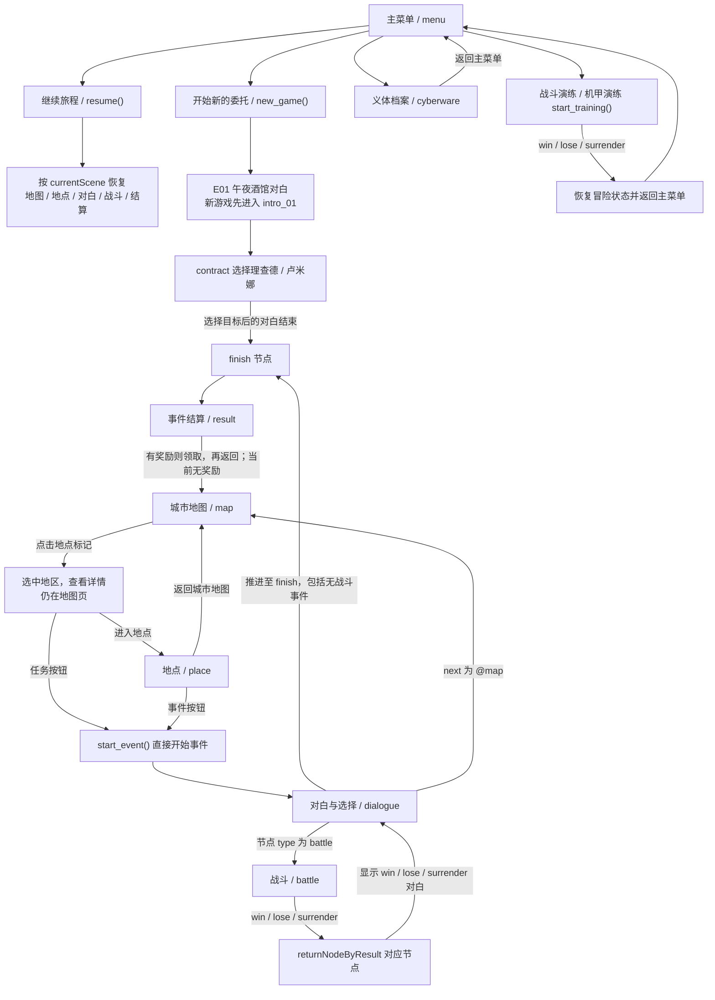

# 午夜委托·第一周 游戏流程与路由

本文说明当前 Demo 的页面如何切换、第一周 13 个事件怎样解锁与分支、战斗结果怎样返回剧情，以及这些行为对应的代码与数据入口。规则本身的含义见 [游戏规则](游戏规则.md)。

**核对信息**：核对日期 **2026-10-07（Asia/Shanghai）**；基线版本 **0.2.6-r1**，地图页面于同日接入，主菜单重构 P0 于同日以 0.2.5-r1 接入、0.2.6-r1 起改用用户审核的逐帧动画背景。本文对照 [scripts/game.gd](../scripts/game.gd)、[scripts/main.gd](../scripts/main.gd)、[scripts/map.gd](../scripts/map.gd)、[scripts/menu.gd](../scripts/menu.gd)、各页面脚本以及 [data](../data) 下的 JSON 做**文档静态核对**，不重跑剧情与战斗的完整游玩；地图的画面与真实指针输入验收见[地图界面验收清单](地图界面验收清单.md)（本轮 `36-capture-final` 5 checks、`37/38/39` 各 111 checks，0 failures）。事件 ID 与内容以 [data/weeks/week1/events.json](../data/weeks/week1/events.json) 和 [data/weeks/week1/week.json](../data/weeks/week1/week.json) 为准。

## 页面与切换

页面由 [main.gd](../scripts/main.gd) 的 `VIEWS` 映射和 `Game.page` 共同决定。整个游戏只有一个主场景，切换页面时销毁旧视图并实例化新视图。【已实现】

| 页面键 `page` | 场景 | 主要进入方式 |
| --- | --- | --- |
| `menu` | [scenes/menu.tscn](../scenes/menu.tscn) | 启动、`Game.menu()`、演练结束后返回；演练入口折叠在“演练”分组内 |
| `map` | [scenes/map.tscn](../scenes/map.tscn) | `go_map()`，事件结算后返回 |
| `place` | [scenes/place.tscn](../scenes/place.tscn) | 地图点击“进入地点 →”调用 `visit()` |
| `dialogue` | [scenes/dialogue.tscn](../scenes/dialogue.tscn) | 事件开始或推进到对白节点 |
| `battle` | [scenes/battle.tscn](../scenes/battle.tscn) | 事件节点 `type: battle` |
| `result` | [scenes/result.tscn](../scenes/result.tscn) | 事件 `finish` 节点 |
| `cyberware` | [scenes/cyberware.tscn](../scenes/cyberware.tscn) | 主菜单"义体档案" |

切换细节：

- 只有**进入或离开战斗**时才播放自下而上的霓虹花屏转场（覆盖约 0.58 秒、消退约 0.32 秒），期间锁定输入（`transition_locked`）。其他页面切换直接替换视图。
- 转场或战斗忙碌（`battle_busy`）期间，流程请求会被拒绝，避免重复提交。
- 对白、选项和战斗退出都携带 `revision` 做过期校验；不匹配的请求会被忽略。
- 全局 Esc 先关闭开发面板；地图页随后关闭周次弹窗或浮动详情，再返回菜单。战斗页按既有输入处理关闭牌堆弹层或取消瞄准。主菜单按“关闭新委托确认 → 折叠演练分组 → 既有恢复”的顺序处理，存在进度且未消费前两步时，Esc 恢复当前页面。F1 在开发模式下开关调试面板；输入锁期间不处理这些切换。
- 主菜单的新委托在已有内存进度或磁盘存档时打开内嵌 `Control` 模态弹层：底层按钮禁用并设为 `FOCUS_NONE`，默认焦点在“返回”，Tab 只在两个弹层按钮间循环；取消或 Esc 关闭后恢复原按钮状态，不改动进度或损坏的存档文件。
- 地图页的目标标记通过 `Game.map_target_events()` 推导，不读取 `targetId` 或 `activeEventId`；悬停约 0.2 秒显示只读预览，点击后固定详情，空白处或 Esc 关闭。

下面的流程图概括当前页面路由，覆盖新游戏、地图、事件、战斗与演练的走向：

图中要点：新游戏先进入 E01 对白；地图既能直接开始事件也能进入地点；事件可能没有战斗而直接推进到 `finish`；只有 `finish` 才结算；结算后领取回地图；战斗按 `returnNodeByResult` 返回；演练结束返回菜单且与冒险隔离。

## 第一周事件分支与解锁表

第一周共 **13 个事件**，由 [week.json](../data/weeks/week1/week.json) 的 `eventIds` 列出。表中"战斗"列给出该事件是否包含战斗以及战斗 ID；"结算效果"列给出 `finish` 节点写入的状态。【已实现】

| ID | 标题 | 地点 | 类型 | 必要解锁 | 关键选择与推进 | 战斗 | 结算效果 |
| --- | --- | --- | --- | --- | --- | --- | --- |
| `E01` | 午夜酒馆 | 地下酒馆 `bar` | 主线 | 无 | `contract` 选择"理查德"或"卢米娜"，写入 `setTarget`；随后 `chosen_01` → `finish` | 无 | 无；完成后解锁以 E01 为前置的地点 |
| `E02` | 骚动的垃圾场 | 垃圾场 `junkyard` | 可选 | 完成 E01 | 无选择；`intro_04`（stage）→ 战斗 | `B02` | 无 |
| `E03` | 蜂巢城寨的艾克 | 蜂巢城寨 `hive` | 主线 | 完成 E01 | `payment`：支付 300 CR 并设 `alleyClue`，或拒绝支付转战斗 | 仅拒绝路线有 `B03` | `setFlag alleyClue`（两条路线都能拿到线索） |
| `E04` | 后巷深处 | 后巷 `alley` | 主线 | 旗标 `alleyClue` | 无选择；`intro_03`（stage）→ 战斗 | `B04` | `setFlag portClue` |
| `E05A` | 港口追击 · 理查德 | 港口 `port` | 主线 | 全部：旗标 `portClue`、目标 `richard` | `join` 选择接受或拒绝；两条线都汇入 `finish` | `B05A` | `setFaction company` |
| `E05B` | 港口追击 · 卢米娜 | 港口 `port` | 主线 | 全部：旗标 `portClue`、目标 `lumina` | `join` 选择接受或拒绝；两条线都汇入 `finish` | `B05B` | `setFaction resistance` |
| `E06` | 入职公司 | 沃斯大楼 `tower` | 主线 | 完成 E05A | 无选择、无战斗，直接推进到 `finish` | 无 | 无 |
| `E07` | 加入革命军 | 革命军营地 `camp` | 主线 | 完成 E05B | 无选择、无战斗，直接推进到 `finish` | 无 | 无 |
| `E08` | 赛博精神病 | 五号街区 `block5` | 可选 | 完成 E06 或 E07 | 无选择；`intro_02` → 战斗 | `B08` | 无 |
| `E09` | 危险的野狼 | 发电厂 `power` | 主线 | 全部：完成 E06、阵营 `company` | 无选择；`intro_03` → 战斗 | `B09` | 无 |
| `E10` | 进攻发电厂 | 发电厂 `power` | 主线 | 全部：完成 E07、阵营 `resistance` | 无选择；`intro_03` → 战斗 | `B10` | 无 |
| `E11` | 变异的鱼 | 黑潮泵站 `pump` | 可选 | 完成 E06 或 E07 | 无选择；`intro_01`（stage）→ `intro_02` → 战斗 | `B11` | 无 |
| `E12` | 机甲复仇 | 蜂巢城寨 `hive` | 主线 | 完成 E09 或 E10 | 无选择；`intro_02` → 战斗 | `B12` | `finishWeek`，标记第一周完成 |

补充说明：

- 事件不是一条无条件的线性故事。E02、E08、E11 是可选事件，未完成不影响主线；E09 与 E10 互斥于阵营，只能走当前阵营那一条；E12 依赖"本阵营发电厂任务"。
- E03 的"支付 300 CR"与"拒绝支付后战斗"是两条不同分支，但都会在 `finish` 取得 `alleyClue`。初始信用点为 0，正常开局无法直接支付，需要开发面板或拒绝路线。
- E05A 与 E05B 的 `join` 选择接受或拒绝都会走到同一阵营结果；拒绝只是被对方以不同对白"劝说"后仍然加入。
- 事件文本只摘录关键分支，未复制整段对白；完整对白见 [events.json](../data/weeks/week1/events.json)。

### 完成、失败与投降路线

区分"是否完成事件"与"是否返回地图"很重要【已实现】：

- **只有 `finish` 节点才算完成事件。** `enter_node()` 进入 `type: finish` 的节点时，先应用该节点效果，再追加 `completeEvent`，然后把页面切到 `result`。战斗胜利本身不会完成事件。
- **胜利**从 `returnNodeByResult.win` 回到该事件的 `win_01` 对白，玩家还要继续推进 `win` 系列节点，直到 `finish` 才结算并完成事件。
- **失败**与**投降**分别回到事件里的 `lose` / `surrender` 节点。这两个节点是对白界面，文本明确写着"此次事件尚未完成，未发放奖励，也未获得胜利线索"，只提供一个"返回城市地图（保留结果）"选项，其 `next` 为 `@map`。
- 因此失败或投降**不会**完成事件，也**不会**加入 `completedEventIds`；回到地图后该事件仍然可用，可以重新开始。返回地图由 `@map` 触发 `go_map()`，结果同时记录在 `battleHistory` 的 `result` 字段中。
- 结算页出现后，页面处于 `result`。点击结算按钮调用 `claim_rewards()`，它要求当前确实在结算页，发放 `rewardIds` 后再返回城市地图。
- E12 的 `finish` 会写入 `week1Complete`，此时结算页标题显示"第一周 · 落幕"，但日期不会变化。

## 战斗返回表

每场战斗在 [battles.json](../data/battles.json) 中都有 `returnNodeByResult`，把 `win` / `lose` / `surrender` 映射到事件节点。【已实现】

| 战斗 ID | 所属事件 | 地点 | 参战敌人（`enemyIds`） | `win` | `lose` | `surrender` |
| --- | --- | --- | --- | --- | --- | --- |
| `B02` | E02 | 垃圾场 `junkyard` | `robot` | `win_01` | `lose` | `surrender` |
| `B03` | E03 | 蜂巢城寨 `hive` | `ike` | `win_01` | `lose` | `surrender` |
| `B04` | E04 | 后巷 `alley` | `gang` | `win_01` | `lose` | `surrender` |
| `B05A` | E05A | 港口 `port` | `richard` | `win_01` | `lose` | `surrender` |
| `B05B` | E05B | 港口 `port` | `lumina` | `win_01` | `lose` | `surrender` |
| `B08` | E08 | 五号街区 `block5` | `psycho` | `win_01` | `lose` | `surrender` |
| `B09` | E09 | 发电厂 `power` | `wolves` | `win_01` | `lose` | `surrender` |
| `B10` | E10 | 发电厂 `power` | `company_robot` | `win_01` | `lose` | `surrender` |
| `B11` | E11 | 黑潮泵站 `pump` | `fish` | `win_01` | `lose` | `surrender` |
| `B12` | E12 | 蜂巢城寨 `hive` | `mech_boss` | `win_01` | `lose` | `surrender` |

说明：

- 当前 10 场战斗的返回结构完全一致：胜利回到 `win_01`，失败回到 `lose`，投降回到 `surrender`。每个事件里的 `lose` / `surrender` 都是同一个返回地图的对白节点。
- E01、E06、E07 三个事件没有战斗节点，因此不出现在上表。
- `B10` 的 `participants` 还包含 `wolves`（剧情里的友军），但实际对手是 `company_robot`。
- `battle_exit()` 会校验请求的 `revision` 与当前一致，并确认该战斗的返回表包含所给结果，否则拒绝跳转。

## 演练路由

主菜单的"战斗演练"与"机甲演练"共用同一条隔离流程，入口收在可折叠的"演练"分组内【临时原型】：

1. 展开"演练"分组后点击入口，调用 `start_training(battle_id)`；菜单里分别传入后巷战斗与机甲战斗（B04、B12）。
2. `Game` 先把当前冒险状态完整备份到内存，再标记 `training_mode`，用一个全新临时状态进入该事件的 `battle` 节点。
3. 战斗过程中 `checkpoint()` 与 `commit_combat()` 因为处于演练模式而**不写入冒险存档**。
4. 战斗结束（`win` / `lose` / `surrender`）调用 `finish_training()`：恢复备份的冒险状态，把页面切回 `menu`，并提示"冒险进度和血量未改变"。
5. 演练不发放事件完成标记、信用点或奖励；返回菜单后冒险进度与血量与进入前一致。

新增演练入口时必须确认对应事件存在名为 `battle` 的节点，并引用正确的战斗；否则 `start_training()` 无法进入战斗。

## 代码与数据入口

修改时先定位行为负责的层，再核对它引用的配置和相关测试。

| 内容 | 位置 | 关键点 |
| --- | --- | --- |
| 流程、条件、存档、演练 | [scripts/game.gd](../scripts/game.gd) | `new_game()`、`meets()`、`available_events()`、`start_event()`、`enter_node()`、`advance()`、`choose()`、`battle_exit()`、`claim_rewards()`、`heal_at()`、`start_training()`、`finish_training()`、`initialize_combat()`、`commit_combat()`、`save_game()` / `load_game()` |
| 页面切换与全局输入 | [scripts/main.gd](../scripts/main.gd) | `VIEWS` 映射、`swap_view()`、`play_transition()`、Esc 与 F1 |
| 战斗规则与快照 | [scripts/combat/combat_model.gd](../scripts/combat/combat_model.gd) | `initialize()`、`play_card()`、`end_turn()`、`draw_cards()`、`snapshot()` / `restore()`、`use_item()` |
| 战斗视图 | [scripts/battle.gd](../scripts/battle.gd) | 选牌、出牌、结束回合、投降、调试结果、转场后返回 |
| 牌堆浏览 | [scripts/combat/pile_view.gd](../scripts/combat/pile_view.gd) | 只读五列网格、默认排序、垂直滚动 |
| 地图 | [scripts/map.gd](../scripts/map.gd)、[scripts/map](../scripts/map)、[data/map.json](../data/map.json)、[data/places.json](../data/places.json) | 底图与 16 地点图钉、位置头像、金色目标、浮动详情；目标与状态由 `Game.map_target_events()`／`map_place_state()` 推导 |
| 地点 | [scripts/place.gd](../scripts/place.gd) | 事件列表、治疗、返回地图 |
| 对白与选择 | [scripts/dialogue.gd](../scripts/dialogue.gd) | 逐字显示、选项禁用、空格 / 回车 / 数字键 |
| 事件结算 | [scripts/result.gd](../scripts/result.gd) | 奖励状态、领取或返回、第一周落幕判定 |
| 主菜单 | [scripts/menu.gd](../scripts/menu.gd)、[scripts/menu/menu_environment.gd](../scripts/menu/menu_environment.gd) | 右侧 350px 栏与入口组织；新委托为内嵌 `Control` 模态确认；逐帧动画背景在菜单环境组件中，不写入剧情状态 |
| 义体档案 | [scripts/cyberware.gd](../scripts/cyberware.gd)、[data/cyberware/cyberware.json](../data/cyberware/cyberware.json) | 局外入口，当前无内容 |
| 第一周事件 | [data/weeks/week1/events.json](../data/weeks/week1/events.json)、[data/weeks/week1/week.json](../data/weeks/week1/week.json) | 对白、选项、效果、解锁与事件顺序 |
| 战斗索引 | [data/battles.json](../data/battles.json) | `enemyIds`、`returnNodeByResult`、`placeId` |
| 敌人与角色 | [data/enemies/enemies.json](../data/enemies/enemies.json)、[data/characters.json](../data/characters.json) | 数值、意图序列、立绘资源 ID |
| 资源与配置 | [data/assets.json](../data/assets.json)、[data/config.json](../data/config.json) | 资源路径、开发模式、初始信用点 |
| 临时战斗规则 | [data/prototype/combat.json](../data/prototype/combat.json) | 手牌、牌组、敌人默认值、回合结束处理 |
| 通用 UI | [scripts/ui.gd](../scripts/ui.gd)、[scripts/widgets/neon_button.gd](../scripts/widgets/neon_button.gd) | 字体、按钮状态、立绘与背景 |
| 自动验证 | [tests](../tests) | `run.tscn` 剧情、`combat_tests.tscn` 战斗、`*_visual.tscn` 图形交互 |

## 阅读时的已知边界

本文的文档核对发现以下需要留意的地方。它们**未在本文核对中修改代码**，只在文档中如实记录。

- **地图资源路径的位置**：[map.json](../data/map.json) 只保存资源 ID `city_map` 与 `coordinatesStatus`；实际路径在 [assets.json](../data/assets.json) 的 `city_map` 项里，指向 `assets/map/map.jpg`。底图与 16 地点标记已经接入；义体教会只是插画地标，没有玩法入口。
- **地点与可玩内容不同**：16 个地点中，10 个有事件，`garden`、`hotel`、`mall`、`market` 没有事件，`hospital`、`clinic` 只有治疗服务。具体解锁见[游戏规则](游戏规则.md)的地点表。
- **战斗界面文案是硬编码**：战斗页顶部标签写死为"临时规则 / 攻击 1 · 敌方 HP 3"，与当前 [combat.json](../data/prototype/combat.json) 一致；如果以后只改 JSON 数值而不改这段文案，界面会和实际规则不一致。
- **`lose` / `surrender` 是占位**：这两个节点的文本写明"后续剧情待补"；它们不设置任何旗标，只把结果记入 `battleHistory`。
- **首回合空手恢复边界**：`start_hand()` 用"第 1 回合且手牌为空"判断首次发牌。提高敌人 HP 后，若第一回合打完牌但未获胜、退出再进入同一战斗，可能被误判为首次发牌而额外补牌。[维护文档](维护文档.md) 标注这属于代码审查推导，未专门复现。
- **多敌与大牌组未验收**：模型有 `enemies` 数组，但界面与既有验收都以单敌、三张手牌为准。
- **存档迁移只覆盖 1 → 2**：新增字段、删除 ID 或回退程序前，需要按 [维护文档](维护文档.md) 的存档章节处理。
- **对白立绘无条件去白**：透明对白 PNG 不能只靠 `whiteKey=false` 关闭去白；详见 [维护文档](维护文档.md)。
- **地图坐标已按插画校准**：[map.json](../data/map.json) 的 `coordinatesStatus` 为 `illustration-calibrated`，16 个 `mapAnchor` 已按本轮底图校准到建筑；更换底图后需要重新校准。
- **本文只做文档静态核对**：不改代码、不重跑剧情与战斗测试，也未写入或读取用户存档；地图的画面与真实指针输入已按[地图界面验收清单](地图界面验收清单.md)执行（本轮 `36-capture-final` 5 checks、`37/38/39` 各 111 checks，0 failures）。

## 相关文档

继续查阅玩法含义、维护边界或资源方向时，使用以下入口。

- [游戏规则](游戏规则.md)：玩法循环、战斗数值、治疗与日期、奖励与存档的规则说明。
- [文档索引](README.md)：各份文档的用途与阅读顺序。
- [维护文档](维护文档.md)：修改约定、存档恢复、已知边界与回归命令。
- [修改记录](修改记录.md)：各次修改的原因与验证记录。
- [开发接入说明](开发接入说明.md)：卡牌、敌人、资源与剧情的接入方式。
- [美术方向](美术方向.md)：城市总览地图与标记的美术方向。
- [项目说明](../README.md)：体验方式与版本概览。
