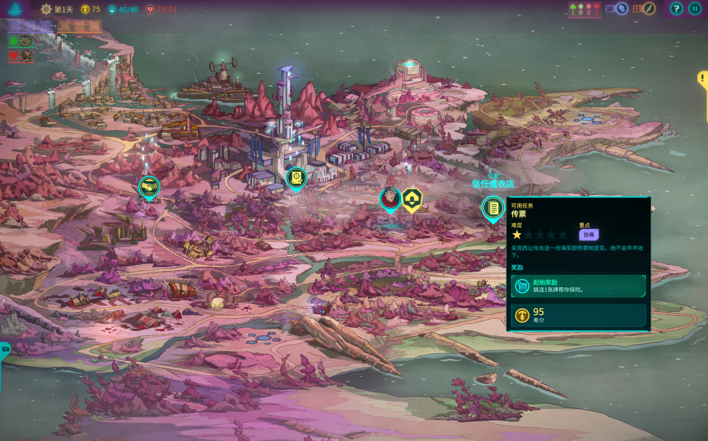

# 城市总览地图美术与交互方向

自 **2026-10-04（Asia/Shanghai）** 起，《午夜委托》地图采用用户提供的《欺诈之地》截图作为主要参考：大幅城市总览插画承载地点与任务标记，选择标记后查看详情，再进入地点或事件。取消此前的地区小人跑图方案，不制作地图角色小人、行走动画、可行走场景、寻路或碰撞系统。

本文规定地图制作方向。**2026-10-07 / 0.2.4-r1** 已接入 `assets/map/map.jpg`、16 个地点符号、当前位置头像、金色目标与浮动详情；实际验证见[地图界面验收清单](地图界面验收清单.md)。后续扩展继续遵循这些约定。

## 参考图与借鉴重点

下面是用户本次提供的参考截图，保留于工程文档目录，供后续制作核对。

参考的是总览地图的组织和交互：地图插画占据主要画面，地标形成区域差异，标记覆盖在对应地点上，详情面板集中展示当前选择。具体建筑、角色、任务内容与图标采用《午夜委托》的设定。

截图中的人物头像是地图界面标记的参考形式；本项目可按需要使用头像或图标表示当前地点，不把它扩展为在地图上自由移动的角色。

## 统一风格

保留暗色二次元赛博都市的插画方向：清楚描线、块面阴影、深蓝紫黑环境，以及局部青色与洋红霓虹。现有对白与战斗立绘继续作为人物美术依据。

色彩以现有界面为锚点：深色底 `#070E19`、洋红重点 `#F04B88`、青色提示 `#58E1EB`、浅暖文字 `#F3EBDE`。建筑和环境可加入低饱和灰紫、锈色与脏绿。灯光重点服务于城市地标与交互标记，避免整张底图的高饱和细节争夺注意力。

## 总览插画设计

底图需要展示城市地理与区域关系，让玩家能够把任务标记对应到具体地点。

- 使用俯瞰斜视的总览构图，通过建筑、地形与高低层次区分城市区域，优先保证主要地标可辨认。
- 按现有地点配置布局酒馆、沃斯大楼、医院、蜂巢城寨等地点，先核对地点清单，再决定画面中的空间关系。
- 用道路、桥梁、管线和区域边界组织城市关系；这些元素是插画构图，不定义角色可行走路线。
- 为地点标记及展开的信息面板预留低对比区域，避免标记互相遮挡或掩盖关键建筑。
- 生成底图时保持干净，不把任务图标、地点文字、HUD 或详情面板画死在图片里。这些内容交由 Godot 叠加。

本轮不建立“总览 → 可行走地区”的双层探索结构。点击地点后继续接入现有地点、对白、治疗或战斗流程；地点背景仍是独立资源。

## 标记与详情面板

以“选择地点 → 查看可用内容 → 确认进入”的流程起稿，具体布局通过游戏内截图验收。

| 元素 | 设计方向 |
| --- | --- |
| 地点标记 | 锚定对应建筑或区域，采用统一轮廓的图钉或徽章，名称保持清楚 |
| 可用事件 | 主线与可选采用不同符号，保留现有数量提示，颜色辅助区分 |
| 当前位置与目标 | 青色诺伦圆头像表示真实所在地，金色图钉表示可推进主线；同点时并存 |
| 当前选择 | 浅色外圈并展示地点名称，保留当前与目标状态色 |
| 已完成与锁定 | 使用勾、锁定等形状区分，提供状态说明，避免只靠颜色表达 |
| 详情面板 | 展示地点名称、描述、可用事件及进入或治疗操作，减少对关键地图区域的遮挡 |
| 扩展任务信息 | 奖励、难度、交涉或战斗类型仅在已设计且有真实数据支持时展示，不照搬参考图中的数值与规则 |

标记使用地图区域内的比例锚点定位，缩放和留白改变后仍与底图地标一致。选择标记先查看详情，明确的事件或进入按钮再触发流程；不能因悬停就开始事件。

不因更换地图视觉新增旅行费用、自动推进日期或事件解锁规则。已有条件、任务状态与保存仍由 `Game` 管理。

### 标记尺度与亮度（已接入，实测通过）

按用户确认把地点与事件图标放大约 1.5 倍并提亮。运行时标记高度已从逻辑 48
像素提高到 72 像素，当前位置头像从 40 提高到 56 像素；符号由
[symbol_readability.gdshader](../scripts/map/symbol_readability.gdshader) 在保留
透明边缘下以 `lift = 0.36` 提亮，外框 shader 加宽亮边并混入深色实底，让
标记与底图纹理形成更明确的区分。状态配色为普通浅灰白、当前位置青 `7af4ff`、目标金
`ffdb72`／暖白符号、锁定 `a7b6ca`，锁定仍可辨；放大后须重新检查 16 个
地点的标记与头像在密集区域不互相遮挡，名称与角标仍可读。

源 PNG 与三份 SVG 外框保持原像素，只调整运行时尺寸与着色。`Game` 的地点、
事件、治疗、日期与存档规则不变。`02-capture` 5 checks、0 failures，
`03-input-default`／`04-input-large`／`05-input-wide` 三尺寸输入每轮各
111 checks、0 failures；证据根目录为 `artifacts/qa/map-legibility-2026-10-07`，
逐项结果见 [地图界面验收清单](地图界面验收清单.md)。

## 素材与接入

分别准备城市总览底图、地点／任务图标和 UI 面板样式。独立标记需要真实透明通道；原始参考与生成成果独立保存，选定素材复制到实际工程资源目录，并记录用途及生成提示词。

总览使用独立的 `cityMapAssetId`，不拿港口或其他地点背景代替。16 个 `mapAnchor` 已按本轮底图逐个校准；正式标记命中范围来自图钉及头像实际尺寸，`mapDisplay` 提供偏移和头像方向。更换插画时重新校准；视图负责叠加与展示，不把交互状态存进图片或动画。

本次提供的参考截图只存放于文档目录，不引用为游戏资源。现有对白与战斗角色资源及其透明处理约定继续遵循 [维护文档](维护文档.md)。

## 首个验收样板

先制作一版城市总览的构图样稿，并在酒馆、医院、沃斯大楼及蜂巢城寨等代表地点上叠加标记，展示一种地点详情状态。未精绘区域可以暂用轮廓表示，但需要保留扩展至完整地点清单的空间。

第一阶段检查整体城市辨识度、标记层次与面板遮挡；第二阶段接入真实 Godot 地图，校准热点并验证选择、事件、锁定提示及已有治疗入口；通过后扩展全城插画与完整标记。

验收关注正常游戏尺寸下的地点名称可读性、标记点击范围、图标重叠、缩放后锚点一致性、面板长文本和返回地图后的状态。按 [开发工具与工作流](开发工具与工作流.md) 保存实际截图与输入验证证据。
